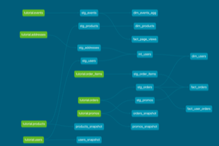

## What is our overall conversion rate?
Ans: Total conversion rate is 36%.

```sql
--total users
select
    (select count (distinct order_guid)
    from dbt_ana.stg_orders)::decimal
    /
    (select distinct session_guid
    from dbt_ana.stg_events)::decimal
    ));
```

## What is our conversion rate by product?
Ans:

```sql
Select * from dbt_ana.dim_products_conversion_rate;
```

## Macros created:
  *

### Dag image
<p align="center"></p>


## What assumptions are your making about each model? (i.e. why are you adding each test?)
The maining tests are in staging model. I want to make sure that I don't have any duplicated data, don't have events that happen in the future, no negative orders or no null values in the the key parameters.

## Did you find any bad data?
No.
